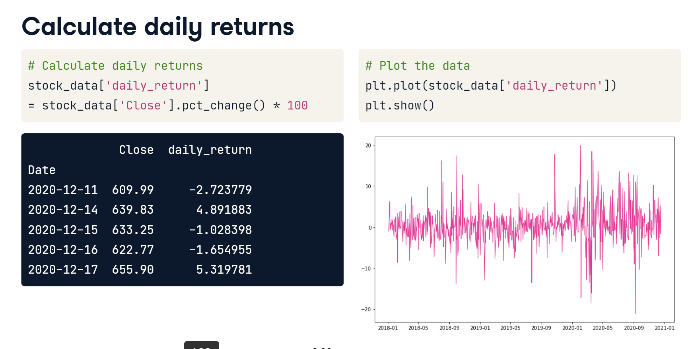

# Financial trading & Python

## **Data Modelling**

Core data model: time series - a sequence of data points indexed in chronological order. 

**Pandas** implementation - **read\_csv** with parameters \(**index\_col**='Date', **parse\_dates**=True\)

!! Pandas supports resampling over different time frames, e.g. eurusd\_weekly = eurusd\_h**.resample\('W'\).mean\(\)**. The aggregation function could be min/max/sum.

## Data Visualisation

For price history visualisations, plotly can be used, and [candlestick charts](https://plotly.com/python/candlestick-charts/) are the standard for price movements and volume. 

## Indicators

SMA - simple moving average - arithmetic mean price over a specified n-period.

**Pandas** example**:** df\['sma\_50'\] = df\['close'\].[rolling](https://pandas.pydata.org/docs/reference/api/pandas.DataFrame.rolling.html)\(window=50\).mean\(\) \# !! rolling can take center=True, or take different shape like triangular or gaussian.

